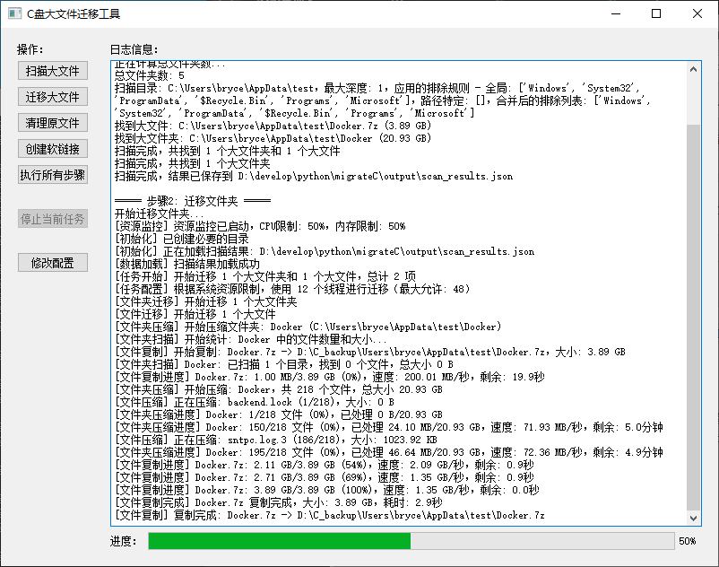

# C盘大文件迁移工具



## 项目简介
本工具用于迁移 C 盘下的Program Files和User/{账号名}/AppData文件夹下超过1G的大文件夹到目标路径，并在C盘原路径下建立软链接，从而达到释放C盘磁盘空间的目的。通过压缩、迁移和解压的方式，确保数据安全迁移，同时保持原有程序的正常运行。

## 功能特点

1. **智能扫描**：扫描指定目录下超过指定大小的文件夹，支持自定义扫描路径和深度
2. **文件夹过滤**：支持全局和路径特定的文件夹排除列表，避免迁移系统关键文件
3. **资源限制**：可设置CPU和内存使用限制，确保迁移过程不影响系统正常运行
4. **压缩迁移**：将大文件夹压缩后迁移到目标路径并解压，确保数据完整性
5. **智能清理**：删除C盘原路径下的文件夹，自动处理文件占用问题，支持多次重试
6. **软链接创建**：在原路径创建指向新位置的软链接，保持程序正常运行
7. **图形界面**：直观的图形界面操作，显示详细日志和进度信息
8. **多线程处理**：自动优化线程数量，提高执行效率
9. **路径映射记录**：保存迁移前后的路径映射，便于管理和恢复
10. **批处理启动**：通过批处理文件启动，简化操作流程

## 系统要求

- Windows操作系统
- Python 3.6+
- 足够的目标磁盘空间

## 快速开始

### 方法一：使用启动批处理文件（推荐）

1. 双击 `start_migrate_tool.bat` 文件
2. 系统会自动请求管理员权限并启动程序
3. 批处理文件会自动检查Python环境和必要的依赖包
4. 如果缺少必要的依赖包，程序会自动安装

### 方法二：手动启动（传统方式）

1. 安装依赖包：

```bash
pip install -r requirements.txt
```

2. 以管理员身份运行命令提示符或PowerShell
3. 导航到项目目录
4. 运行以下命令：

```bash
python main.py
```

## 配置说明

项目使用`config.yaml`文件进行配置，主要配置项包括：

### 扫描配置

```yaml
scan:
  # 需要扫描的目录路径列表及其对应的扫描层级
  scan_paths:
    - path: "C:\Users\%USERNAME%\AppData"
      max_depth: 2          # 该路径下查询的文件夹深度
      exclude_folders: []   # 该路径下特定需要排除的文件夹名称列表
    - path: "C:\Program Files"
      max_depth: 1
      exclude_folders: ["Common Files", "Microsoft", "WindowsApps"]
  # 文件大小阈值（单位：字节，1GB = 1073741824字节）
  size_threshold: 1073741824
  # 全局排除的文件夹名称列表
  exclude_folders: ["Windows", "System32", "ProgramData"]
  # 扫描结果输出文件路径
  output_file: "./output/scan_results.json"
```

### 迁移配置

```yaml
migration:
  # 目标磁盘路径
  target_path: "D:\C_backup"
  # 压缩文件临时存储路径
  temp_path: "./temp"
  # 映射文件输出路径
  mapping_file: "./output/path_mapping.json"
```

### 性能配置

```yaml
performance:
  # 最大线程数，设置为0表示自动确定
  max_threads: 0
  # CPU使用限制（0-1之间，表示可使用的CPU核心数比例）
  cpu_limit: 0.5
  # 内存使用限制（0-1之间，表示可使用的系统内存比例）
  memory_limit: 0.5
```

## 使用方法

### 图形界面操作

1. **扫描**：点击"扫描"按钮开始扫描大文件夹，扫描结果将显示在日志区域
2. **迁移**：点击"迁移"按钮开始迁移大文件夹到目标路径
3. **清理**：点击"清理"按钮删除C盘原路径下的文件夹
4. **链接**：点击"创建链接"按钮在原路径创建软链接
5. **一键操作**：点击"一键完成"按钮自动执行扫描、迁移、清理和链接创建
6. **取消**：点击"取消"按钮取消当前操作

## 工作流程

1. **扫描阶段**：扫描指定目录，找出超过指定大小的文件夹
2. **迁移阶段**：将大文件夹压缩、迁移到目标路径并解压
3. **清理阶段**：删除C盘原路径下的文件夹，处理文件占用问题
4. **链接阶段**：在原路径创建指向新位置的软链接

## 常见问题

### 1. 为什么需要管理员权限？

创建软链接需要管理员权限，这是Windows系统的安全限制。

### 2. 迁移后原程序还能正常使用吗？

可以。软链接对程序是透明的，程序会像访问原路径一样访问链接，不会感知到文件实际存储在其他位置。

### 3. 如何恢复迁移前的状态？

可以手动将目标路径下的文件夹复制回原路径，并删除软链接。也可以参考`output/path_mapping.json`文件中记录的路径映射关系进行恢复。

### 4. 迁移过程中断了怎么办？

程序会记录已完成的迁移，重新运行程序可以继续未完成的迁移。

### 5. 如何自定义扫描路径和大小阈值？

修改`config.yaml`文件中的`scan.scan_paths`和`scan.size_threshold`配置项。

## 注意事项

1. 迁移前请确保目标磁盘有足够的空间
2. 建议在迁移前备份重要数据
3. 不要迁移系统关键文件夹，可能导致系统不稳定
4. 迁移过程可能需要较长时间，请耐心等待
5. 如遇到无法删除的文件，可能是因为文件被占用，程序会自动重试

## 许可证

[MIT License](LICENSE)

## 贡献

欢迎提交问题和改进建议！